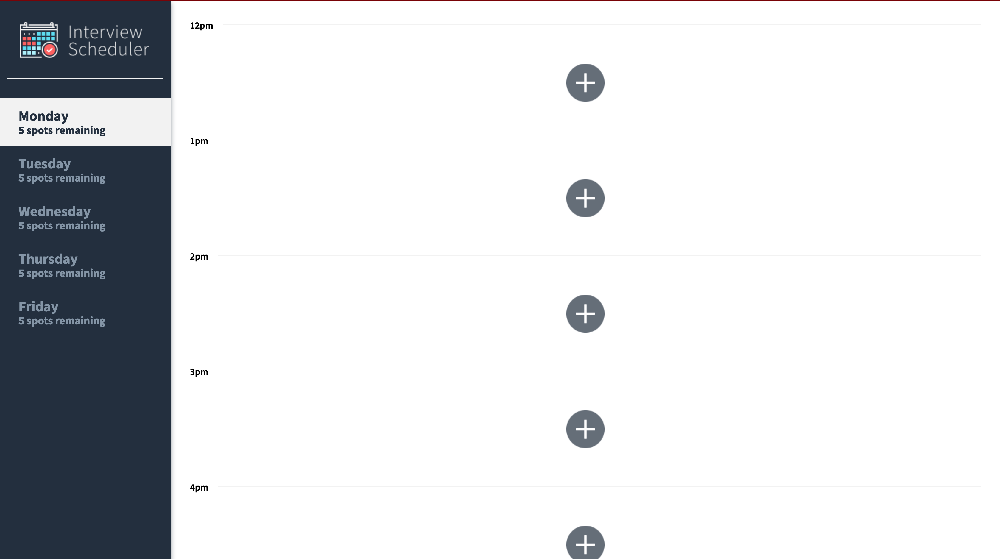
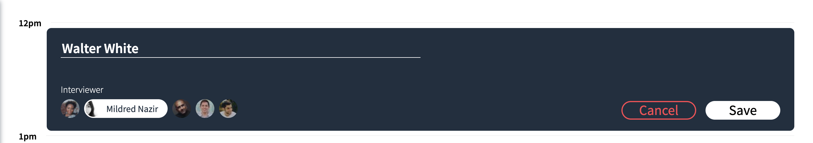
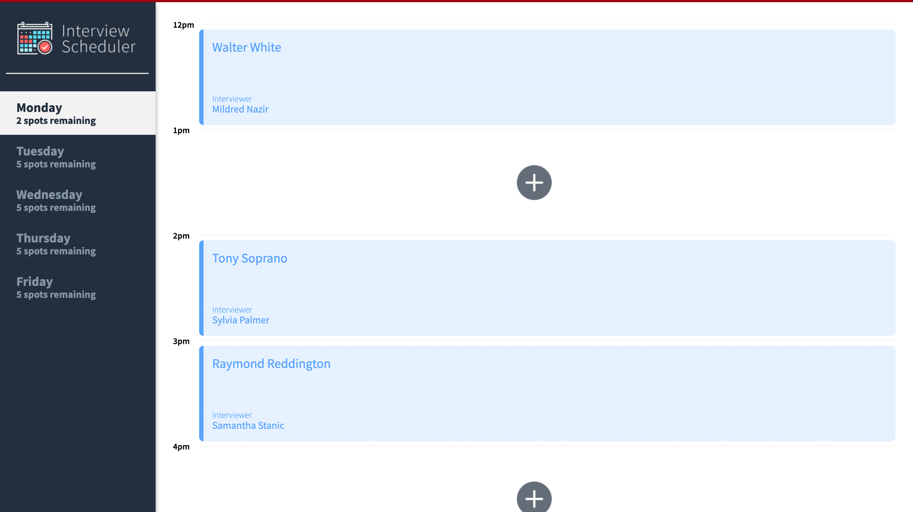
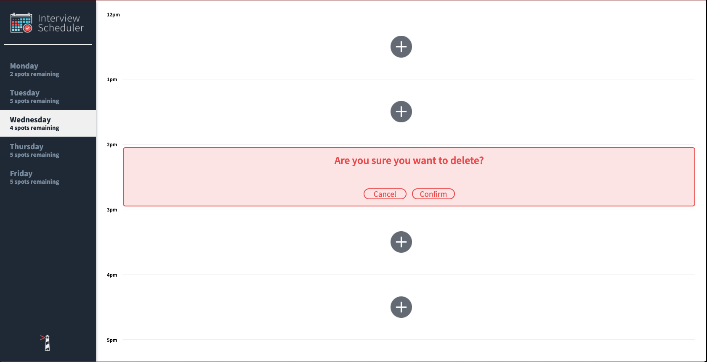

# Interview Scheduler

The interview scheduler is an app created using the latest tools and techniques, to build and test a React application that allows users to book and cancel interviews. An interview can be booked on a selected day of the week (Monday through Friday), for a selected time slot (12pm through 5pm), and with a selected interviewer. We also combine a concise API with a WebSocket server to stimulate a realtime experience.

## Getting Started

- Install dependencies with `npm install`.
- Fork and Clone the scheduler-api from <https://github.com/Oluwatobii/scheduler-api> and then run the development server from the scheduler-api root folder using `npm start`
- On a separate terminal, run development build using `npm start` from project root folder

#### Alternatively (Stretch)

- Production deployment using Netlify: <https://upbeat-hawking-a45e1b.netlify.app/>
- Deploying Server for the database using Heroku: <https://lhlscheduler.herokuapp.com/api/days/>

## Running Jest Test Framework

```sh
npm test
```

## Running Storybook Visual Testbed

```sh
npm run storybook
```

## Dependencies

- react: 16.9.0,
- react-dom: 16.9.0,
- react-hooks-testing-library: 0.6.0,
- react-scripts: 3.0.0,
- react-test-renderer: 16.13.1,
- axios: 0.19.2,
- classnames: 2.2.6,
- node-sass: 4.14.1,
- sass: 1.26.10,
- normalize.css: 8.0.1,
- heroku: 7.42.6

## Final Product

- No Appointments Made
  

- Creating an Appointment
  

- Scheduler App
  

- Deleting an Appointment
  

## Current Functionalities

- Interviews can be booked between Monday and Friday.
- A user can switch between weekdays.
- A user can book an interview in an empty appointment slot.
- Interviews are booked by typing in a student name and clicking on an interviewer from a list of available interviewers.
- A user can cancel an existing interview.
- A user can edit the details of an existing interview.
- The list of days informs the user how many slots are available for each day.
- The expected day updates the number of spots available when an interview is booked or canceled.
- A user is presented with a confirmation when they attempt to cancel an interview.
- A user is shown an error if an interview cannot be saved or deleted.
- A user is shown a status indicator while asynchronous operations are in progress.
- When the user presses the close button of the error they are returned to the Form or Show view (skipping Status and Confirm).
- The application makes API requests to load and persist data. We do not lose data after a browser refresh.
- Pipeline management using CircleCI

## Further Development

- User authenticaion features
- Expanding the scope of the appointments to an entire calendar year
- Give users the ability to select specific week of the year, and the side menu bar would reflects the actual day numbers
